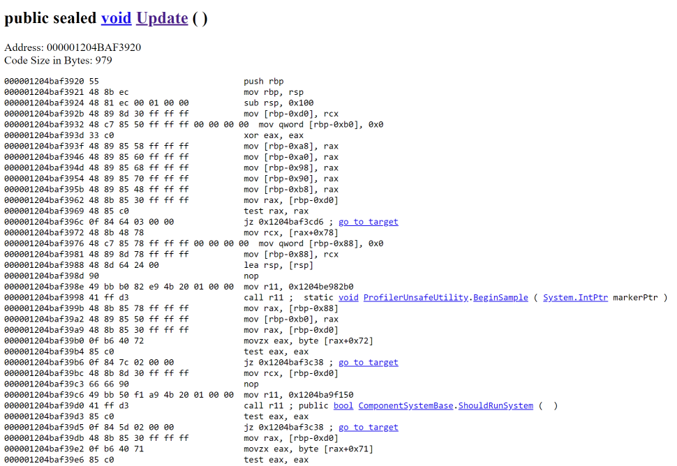

# Asm Explorer
The `AsmExplorer` package allows you to take a look at the code generated by the JIT compiler of the Mono version included in Unity. It has been tested with Unity 2019.3 but may well work with other versions of Unity. (You may have to change the name of the Mono DLL for the PInvokes to `mono.dll` for older versions that still use the .NET 3.5 runtime.)

## Usage
To use this tool, import the included package into your Unity project. Then place the `AsmExplorerHelper` mono behavior on a object in your scene.
This will start the webservice that allows you to explore your assemblies and the code generated by the JIT compiler.

Now point the browser of your choice to `http://localhost:8080/explorer/` (the last slash is absolutely necessary) and use the slick, well-designed (*cough cough*) interface to navigate to the method of your choice to inspect its generated x86/x64 assembly code.

## Caution
Make sure that you are aware of the mode that the code you see is generated in. The tool works from inside the editor as well, but the code generated there will obviously be less optimized. To see fully optimized code (well, to the extent that the Mono 2.6 compiler optimizes the code at least...), make sure to create a non-development build of your game and inspect the code using that build.

## Known issues
 * The web interface is ugly and slow. Yes, I know; but that's not the point of this whole thing. Adding caching and some obvious optimizations to the webservice is left as an exercise to the reader.
 * Everything breaks apart when you miss the final `/` in the webservice's URL. There is probably a very simple fix for this but I wanted to get this out sooner rather than later :)
 * The code could use a clean up. I'm aware of this but don't know when I will find the time to fix this problem. It's good enough for a program hacked into being in two days :)

## License
The code is licensed under a MIT license and is using SharpDisasm under the Simplified BSD license.
